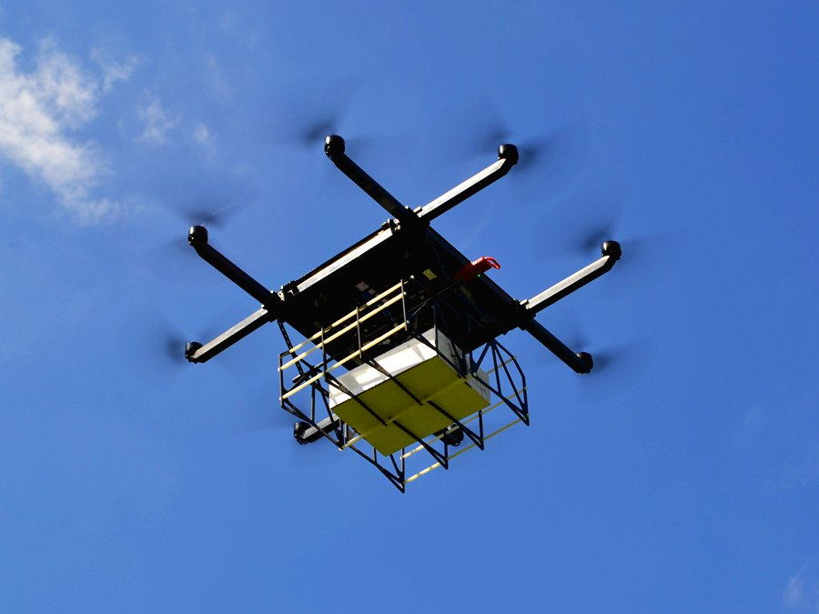

<h1>Октокоптер со специфичным расположением пропеллеров</h1>

<h2>Введение</h2>

Наверное каждый, когда видит впервые летающий дрон, задается рядом вопросов типа:"А сколько он может летать так?","А как далеко он может улететь?","А сколько он может поднять?". Наша команда, проявила интерес к последнему из них, а именно к вопросу грузоподъёмности квадрокоптера компании COEX - clover 4. Имея на руках сопутсвующее оборудование и тягу к полетам, мы эксперементально выяснили, что полезная нагрузка данной модели коптера является масса от 800 до 1000 грамм. Но почему так мало и что с этим делать? Ведь в недалеком будующем уже должна развиться повсеместная доставка товаров на дронах и данное направление не должно ограничиваться 1 киллограммом полезной нагрузки. Пребывая в поисках решений этой проблемы, мы решили реализовать самое элементарное что может прийти в голову - просто присоединить к одному дрону второй! Изучая список рекомендованных организаторами тем на конкурс CopteHack2021, мы нашли такую тему как "Два дрона в твердой связке", что являлось 100-процентным попаданием в интересующую нас область летательной робототехники.

<h2>Разработка</h2>

В результате поиска решения, удовлетворяющего всем нашим требованиям, мы остановились на нескольких вариантах. Было решено для начала сделать октокоптер со специфичным расположением пропеллеров, собственно как если бы два дрона соединили вместе на стандартном расстоянии двух парных пропелллеров квадрокоптера. Промежуточную часть было решено делать из стандартных соединительных деталей дрона (центральная дека,4 луча, 2 крестовины), которые идут в базовой комлектации clover 4. 

В качетве полетного контролера был выбран Pixhavk v.4, т.к. он, в отличии от стандатроного на клеверах Pixracer имеет больше сигнальных портов для движков. *Картинка пиксховк и сигнальные выходы*

В качестве радиоприемника и радиопередатчика использовались стандартное оборудование FlySky.*картика пульта и приемника*

Чтобы не отходить от темы "двух дронов в твердой связке", было принято решение использовать для одного октокптера две стандартные платы распределения питания. Вопрос питания временно остается открытым. Сейчас к двум отдельным PDB подсоединяются два отдельных аккамулятора, провода к контроллеру идут только от одной из плат распределения питания. Можно было бы использовать специализированную PDB и один обычный аккамултор на 5200 mA/h, но тогда бы наш проект потерял свою "изюминку" и основную идею для развития.

<h2>Прошивка</h2>

https://drive.google.com/drive/folders/1Zc878JuDw_4FKSvvzibzGLVOnaxFhiqL?usp=sharing - ссылка на прошивку октокоптера.

Основное отличие нашей прошивки, от прошивки clover 4, не считая того, что первый окто-, а второй квадро-коптер, является наличие особого airfrime файла под названием 
